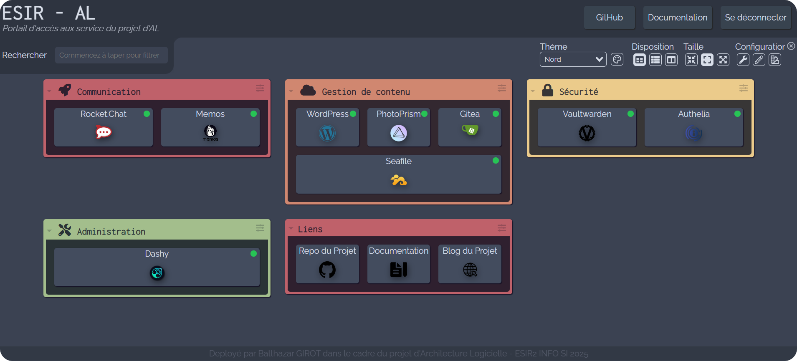

# ESIR-as-a-Service 2025 - Infrastructure Micro-Services
Auteur : Balthazar GIROT, ESIR2 INFO SI - Année 2025-2026

Sommaire :
- [Vue d'ensemble](./README.md)
- [Authelia - Serveur d'Authentification & SSO](./documentation/authelia.md)
- [Guide de Démo des Services](./documentation/demo.md)

## Vue d'ensemble
Ce dépôt contient la configuration et les procédures de déploiement d'une infrastructure de services auto-hébergés. Le projet repose sur une architecture conteneurisée orchestrée par Docker Compose, sécurisée par un Reverse Proxy (Nginx) et un fournisseur d'identité centralisé (Authelia).

## Aperçu des Services

1. **Reverse Proxy (Nginx)** : Gère les requêtes entrantes, le routage et la sécurité TLS/SSL.
2. **Authentification (Authelia)** : Fournit le Single Sign-On (SSO) et l'authentification à deux facteurs (2FA).
3. **Dashboard (Dashy)** : Tableau de bord centralisé pour accéder aux différents services.
4. **Git Forge (Gitea)** : Hébergement de dépôts Git avec intégration SSO.
5. **Site Web (WordPress)** : Plateforme de gestion de contenu avec authentification SSO.
6. **Prise de notes (Memos)** : Application de prise de notes avec support OAuth2.
7. **Mots de passe (Vaultwarden)** : Gestionnaire de mots de passe auto-hébergé.
8. **Synchronisation de fichiers (Seafile)** : Solution de stockage et de synchronisation de fichiers.
9. **Galerie Photo (Photoview)** : Application de gestion et de visualisation de photos.

## Architecture Logicielle

L'infrastructure est isolée dans un réseau Docker privé. Seul le Reverse Proxy expose les ports 80 (HTTP) et 443 (HTTPS).

**Flux de connexion :**
1.  L'utilisateur accède à une URL publique (ex: `git.komquest.cc`).
2.  Nginx intercepte la requête.
3.  Pour les services protégés, Nginx vérifie l'authentification auprès d'Authelia via une sous-requête (`auth_request`).
4.  Si authentifié, Nginx transfère la requête au conteneur du service concerné.

## État des Services

Le tableau ci-dessous résume l'état de déploiement et de sécurisation de chaque service.

| Service | Solution | Statut | SSO / OIDC | Sécurisé HTTPS |
| :--- | :--- | :--- | :--- | :--- |
| **Reverse Proxy** | Nginx | ✅ Fonctionnel | N/A | ✅ Oui |
| **Authentification** | Authelia | ✅ Fonctionnel | N/A | ✅ Oui |
| **Dashboard** | Dashy | ✅ Fonctionnel | 🛡️ Proxy | ✅ Oui |
| **Git Forge** | Gitea | ✅ Fonctionnel | ✅ Natif | ✅ Oui |
| **Site Web** | WordPress | ✅ Fonctionnel | ✅ Plugin | ✅ Oui |
| **Prise de notes** | Memos | ✅ Fonctionnel | ✅ Natif | ✅ Oui |
| **Mots de passe** | Vaultwarden | ✅ Fonctionnel | N/A | ✅ Oui |
| **Synchronisation** | Seafile | ✅ Fonctionnel | ⚠️ Partiellement | ✅ Oui |
| **Galerie Photo** | Photoview | ✅ Fonctionnel | ❌ Payant | ✅ Oui |

**Légende :**
* ✅ **Fonctionnel** : Déployé, configuré et opérationnel.
* 🛡️ **Proxy** : Service ne supportant pas OIDC, protégé par l'authentification Nginx.
* ⚠️ **Partiellement** : SSO/OIDC fonctionnel mais avec des limitations (voir Feedback).
* ❌ **Abandonné** : Tentative de déploiement échouée ou remplacée (voir Feedback).

## Retour d'expérience et Améliorations

**Choix particuliers:**
* **Rocket.Chat :** Initialement, je ne voulais pas utiliser Rocket.Chat car trop lourd. J'ai donc essayé Mattermost, mais la configuration OIDC était payante. J'ai également testé VoceChat, léger et rapide à configurer, mais donc la toute toute dernière étape de connexion via OIDC n'était pas implémentée par les développeurs... Je suis donc revenu à Rocket.Chat, qui fonctionne parfaitement avec Authelia.
* **Immich vs Photoview :** J'ai initialement tenté de déployer Immich. Cependant, je n'ai pas réussi à pull l'image. D'après les logs, cela semblait être lié à aux limitations de débit sur le registre de conteneurs GitHub (`ghcr.io`), bloquant le déploiement. J'ai donc choisi **Photoview**, plus léger (image unique) et hébergé sur Docker Hub.

**Obstacles rencontrés :**
* **Seafile & OIDC :** La configuration OIDC de Seafile est complexe. Elle nécessite un mappage manuel des attributs dans un fichier Python (`seahub_settings.py`). De plus, je n'ai pas réussi à faire fonctionner la création d'utilisateurs via SSO. Ainsi, le SSO fonctionne mais amène vers une page d'erreur sur Seafile demandant de contacter un administrateur. Il est reste possible de se connecter avec des comptes locaux, notamment le compte `guest` avec le mot de passe `welcome2u!`.
* **Documentation** : Le déploiement de certains services est assez spécifique, et j'ai eu du mal à trouver de la documentation en ligne. L'utilisataion d'outil d'IA est tentant mais les réponses offertes induisent très souvent en erreur.

**Propositions d'amélioration :**
* Trouver un moyen de déployer plus facilement le fichier `authelia/config/configuration.yml`. En effet, il contient des secret, on ne peut donc pas le push dans le repo. Il pourrait être intéressant de connecter une éditeur de code en ssh.
* S'intéresser aux optis des services, chose que je n'ai pas eu le temps de faire.
* Tester les services et le loading sous contrainte (plusieurs utilisateurs simultanés).